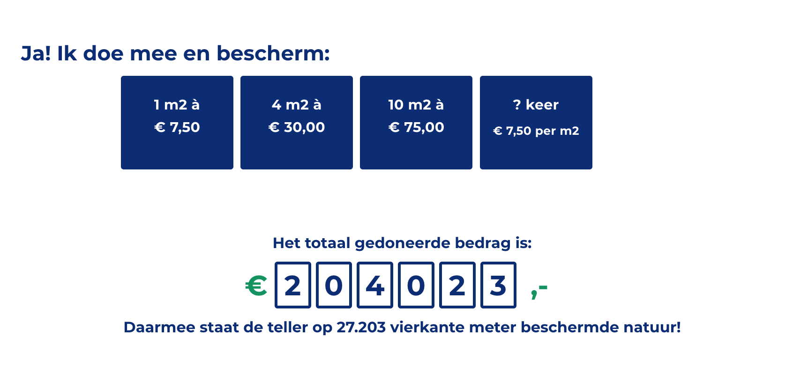

# code_examples

* code_snippets :
    * a few bits of custom WP functions I had to make for a client:
        * *gforms_donation-mail_attachment.php:* generates an attachment image and adds it to a GForms mail
        *  *donation_buttons_counter.php:*  custom donation buttons and counter in the form of a shortcode.   
        * plus a PHP class that can generate the *functionality and structure* for calendar views. Can be used to generate a calendar with previous/next month, trailing and leading days, week numbers, etc.
* ikwilspril : landing page for <a href="https://ikwil.spril.nl" target="_blank">Spril</a>
* starter_theme : example of one of the themes I've worked with, active on <a href="https://www.digital-twin-research.nl/">digital-twin-research.nl</a>